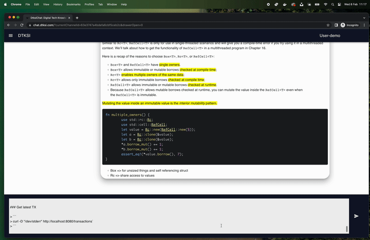

# mui-chat-md

> websocket chat app

- markdown support with [react-markdown](https://github.com/remarkjs/react-markdown)
- encoding state as query parameters with [use-query-params](https://github.com/pbeshai/use-query-params)

---
## Live demo @ [chat.dtksi.com](https://chat.dtksi.com)

---

